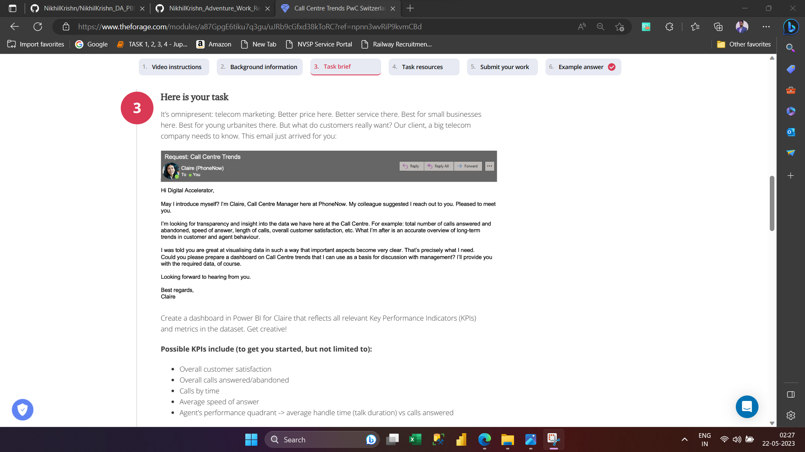
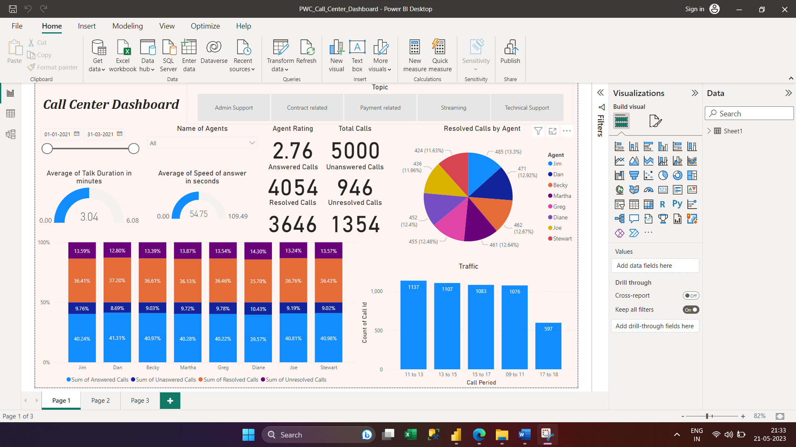
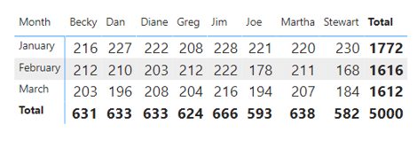
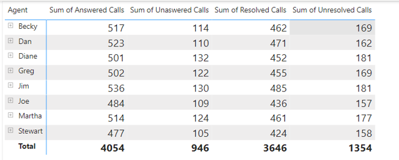

# PWC CALL CENTER DASHBOARD:
## Project Overview:
Developed and implemented PwC call center dashboards to monitor customer experience, track employee performance, and identify areas for improvement.

## Final Dashboard:

### Objectives:
###### •	Overall customer satisfaction
###### •	Overall calls answered/abandoned
###### •	Calls by time
###### •	Average speed of answer
###### •	Agent’s performance -> average handle time (talk duration) vs calls answered
###### •	Call traffic vs. call period
###### •	Monthly total no. of calls per agent 

###### •	Count of answered, unanswered, resolved and unresolverd calls per agent 

